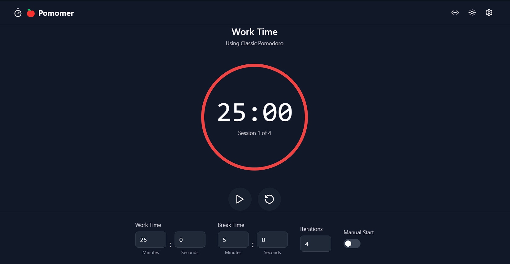

# Pomomer

A modern, feature-rich Pomodoro timer application built with React and TypeScript.



## Features

- 🎯 Customizable work and break intervals
- 🎨 Personalized themes with color picker
- ⏰ Preset timer configurations
- 📅 Scheduled timer sessions
- 🔄 Recurring schedules (daily, weekly, monthly)
- 🌓 Dark/Light mode toggle
- ⚡ Manual session control
- 🎯 Progress tracking
- 📱 Responsive design

## Getting Started

### Installation

1. Clone the repository:
   ```bash
   git clone https://github.com/HawkdotDev/pomomer.git
   cd pomomer
   ```

2. Install dependencies:
   ```bash
   npm install
   ```

3. Start the development server:
   ```bash
   npm run dev
   ```

4. Open [http://localhost:5173](http://localhost:5173) in your browser.

## Usage

### Timer Controls

- Click the play/pause button to start/stop the timer
- Use the reset button to restart the current session
- Toggle manual start mode for breaks and work sessions

### Customization

1. Click the settings icon to open the sidebar
2. Choose from preset configurations or create your own
3. Customize colors using the color picker
4. Set up scheduled sessions with recurrence patterns

### Scheduling

1. Navigate to the Schedules tab in settings
2. Create new schedules with specific times and recurrence patterns
3. Enable/disable schedules as needed
4. Edit or delete existing schedules

## Contributing

Contributions are welcome! Please read our [Contributing Guide](CONTRIBUTING.md) for details on our code of conduct and the process for submitting pull requests.

## License

This project is licensed under the MIT License - see the [LICENSE](LICENSE) file for details.

## Author

**Dwaipayan Dutta** ([@HawkdotDev](https://github.com/HawkdotDev))

## Acknowledgments

- Inspired by the Pomodoro Technique® by Francesco Cirillo
- Built with React, TypeScript, and Tailwind CSS
